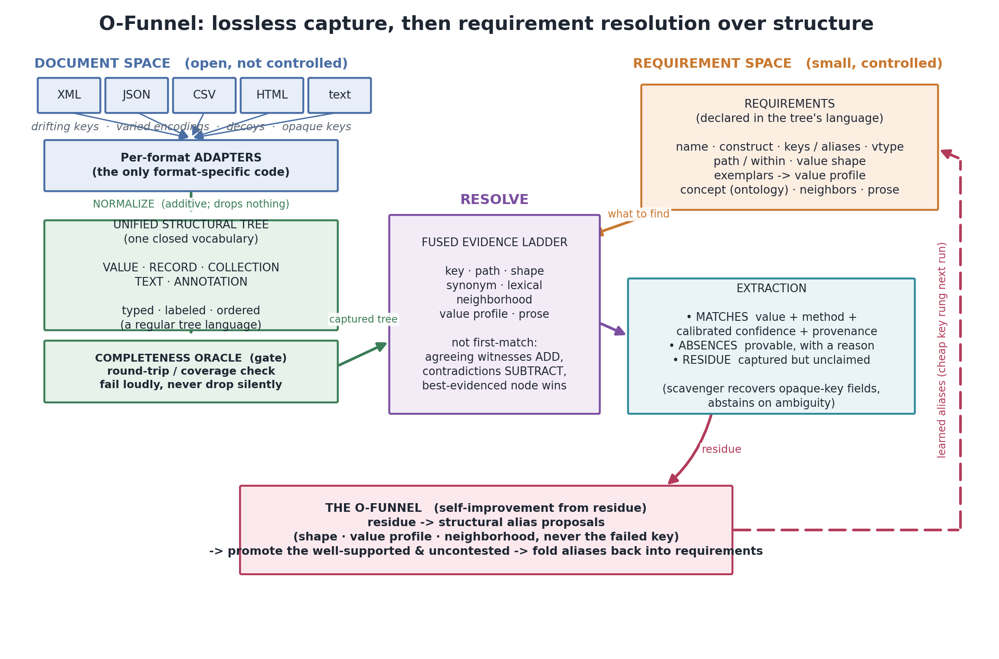
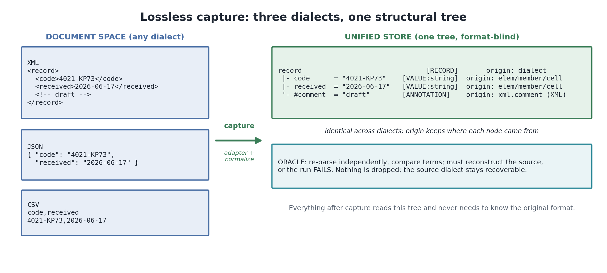
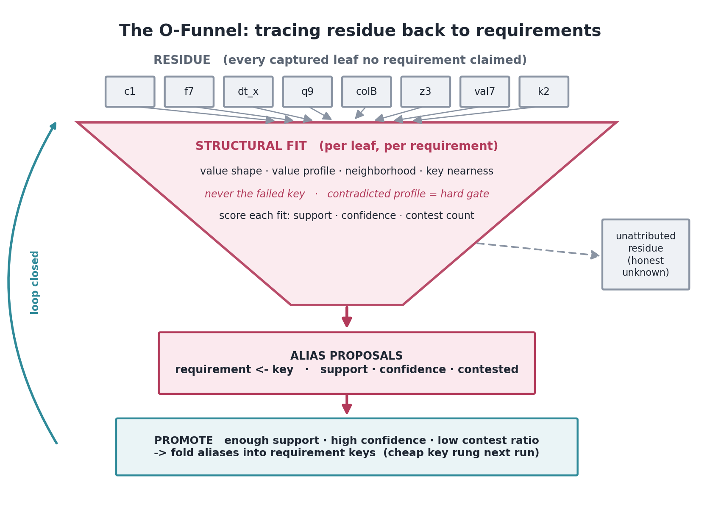

# O-Funnel

**Lossless structural capture, then drift-robust, requirement-driven extraction from heterogeneous documents.**

O-Funnel pulls a fixed set of fields out of documents that arrive in many formats (XML, JSON, CSV, HTML, and
plain key-value text) and under many, drifting schemas, without the brittleness of hand-written byte regexes.
It is pure Python standard library, has zero dependencies, is fully typed, and is deterministic.

```bash
pip install ofunnel
```

```python
from ofunnel import Requirement, extract

raw = b'<record><code>4021-KP73</code><received>2026-06-17</received></record>'

result = extract(raw, [
    Requirement("code", keys=("code", "id"), shape=r"\d{4}-[A-Z]{2}\d{2}"),
    Requirement("received", keys=("received", "date"), normalize="date"),
])

result.value("code")       # '4021-KP73'
result.value("received")   # datetime.date(2026, 6, 17)
```

The same requirements keep working when the next document is JSON, renames `code` to `c1`, writes the date as
`June 17, 2026`, or inserts a same-shaped decoy before the real value.

---

## Why

A great deal of software does nothing more than turn documents into records. In practice the same logical field
shows up under different key spellings (`received_date`, `dateReceived`, `RECEIVED_DT`), in different formats,
with different value encodings, next to decoys of the same shape, and sometimes under keys that carry no meaning
at all (`c1`, `f7`, column 4). The reflexive tool, a regular expression over the raw bytes, is brittle for a
structural reason: it must encode, in one pattern, both what the value looks like and how to tell it apart from
everything around it, because the byte stream is all it can see. Change either and it fails, silently returning
nothing or, worse, confidently returning the wrong span.

O-Funnel separates the two concerns:

1. **Capture** transcribes any supported document, losslessly, into one structural tree, so format stops
   mattering above the adapter layer.
2. **Resolve** declares each requirement in the tree's own terms and locates it by fusing many independent kinds
   of evidence: key, path, value shape, synonym, lexical key similarity, record neighborhood, value population,
   and, only as a last resort, a prose phrase. Nothing is matched against raw bytes.

What no requirement claims becomes **residue**, which the **funnel** traces back to requirements to propose new
key aliases, so coverage grows as the system sees more drift instead of decaying.



---

## Install

```bash
pip install ofunnel
```

From source:

```bash
git clone https://github.com/osamaa-mustafa/ofunnel
cd ofunnel
pip install -e ".[test]"
```

Requires Python 3.9 or newer. No other dependencies.

---

## Core ideas

### 1. Lossless capture into one language

Every supported format is turned by a small adapter into a tree of `Node`s, then a normalization pass
classifies each node into exactly one of five constructors. That closed vocabulary is all the rest of the
library speaks.

| constructor | meaning | example sources |
|---|---|---|
| `VALUE` | an atomic typed value | JSON scalar, XML leaf element or attribute, CSV cell |
| `RECORD` | a keyed group of heterogeneous fields | JSON object, XML element with children, CSV row |
| `COLLECTION` | an ordered group of like items | JSON array, repeated siblings, CSV table |
| `TEXT` | free prose or mixed content | XML text node, a text line |
| `ANNOTATION` | non-content markup | XML comment, processing instruction |

Classification is additive: it sets `construct`, `origin` (the source dialect, for example `xml.attribute`),
and `vtype`, and never removes a node. The source dialect stays recoverable, yet everything downstream can
ignore it.

Markup elements that carry their own text are values too. An element with attributes and text
(`<PMID Version="1">41605291</PMID>`, XML "simple content") or text with inline markup
(`<ArticleTitle>Effect of <i>X</i></ArticleTitle>`, "mixed content") is captured losslessly as a record with
attribute and text children, and resolution reads its text through `value_view(node)`.



Every capture is gated by a **completeness oracle**. For declared formats (XML, JSON, CSV) it independently
re-parses the source and checks the two trees reconstruct each other; for implicit key-value text it checks
byte coverage; for HTML it checks that no visible text is dropped. If the oracle fails, the run fails. A capture
that cannot prove it preserved its input is never used.

```python
from ofunnel import capture, check_complete

node, fmt = capture(raw)                 # fmt auto-detected, or pass fmt="csv"
assert check_complete(raw, node, fmt)    # gate
```

### 2. Requirements, declared in the tree's language

```python
Requirement(
    name,
    construct=VALUE,      # which sub-shape the item is
    keys=(...),           # candidate key spellings (case / separator insensitive)
    vtype=(...),          # allowed value types
    path=(...), within=…, # containment context
    shape=regex,          # value shape, matched against a VALUE's content, not the bytes
    exemplars=(...),      # a few example values -> a value profile (a witness)
    concept=…,            # an ontology concept whose surface terms you supply via synonyms=
    neighbors=(...),      # sibling keys the field's RECORD should contain
    prose=regex,          # a phrase, allowed ONLY inside prose nodes
    normalize=…,          # read the value as "bool" | "number" | "date" | "text" | a callable
)
```

The `shape` is still a regex, but a tame one: it is matched against the content of a single already-localized
value, never against the document. It describes the value; localization is handled structurally and separately.

### 3. Resolution as fused evidence

Resolving a requirement gathers, for each candidate node, every rung of evidence that fires, then fuses them.

| rung | localizes / confirms by | nominal confidence |
|---|---|---|
| key | node key equals an alias (named / attribute / inferred) | 0.95 / 0.90 / 0.75 |
| path | key path ends with the declared containment | 0.90 |
| shape | value content matches `shape`; locates only if no structural cue is declared, else confirms | 0.70 |
| synonym | key is a registered surface form of `concept` | 0.90 exact, up to 0.85 fuzzy |
| lexical | key is the same words spelled differently | 0.55 + 0.30 x similarity |
| neighborhood | the sibling that fits, in a RECORD holding the declared `neighbors` | 0.65, partial credit below |
| value | value fits the requirement's value profile | witness, not a locator |
| prose | the phrase, inside prose nodes only | 0.50 |
| absent | nothing represents it, with a reason | value `None` |

A clean key or path hit is a fast path. Otherwise all rungs are gathered and candidates the same node reaches
by several rungs merge: each extra agreeing witness adds a bounded amount, and a contradicted declaration (a
value that fails the declared shape or profile) subtracts and is tagged. The best-evidenced node wins, not the
first rung that fires. Every `Match` carries its method, confidence, witnesses, and the node it came from.

Absence is a result, not silence: an unlocated field returns a `Match` with `method == "absent"` and a
machine-readable `reason` (`no_candidate`, `shape_rejected:n`, `ambiguous:c1,c2`, ...).

### 4. Value profiles

Names lie; value populations rarely do. Supply a few `exemplars` and O-Funnel derives a profile (character-class
signatures, class mix, length, and the fraction of values that are numbers, dates, or booleans). Two fields
with the same key but different value populations are recognized as different; two fields with different keys
but the same population are recognized as probably the same. The profile participates on every rung.

### 5. The funnel: self-improvement from residue

```python
from ofunnel import Pipeline

pipe = Pipeline(requirements, synonyms=my_synonyms)
for raw in stream:
    pipe.extract(raw)          # accumulates residue
report, promoted = pipe.learn()  # funnel residue -> propose -> promote -> fold aliases into keys
```

The funnel scores each unclaimed leaf against each requirement using structure only (value shape, value
profile, neighborhood, key nearness to aliases), never the key that already failed. Well-supported, uncontested
fits become alias proposals; the safe ones are promoted into the requirements' key sets, so the next run
resolves them on the cheap key rung. What fits nothing stays in the residue, an honest measure of the unknown.



### 6. The scavenger: opaque keys without guessing

`extract(..., scavenge=True)` adds a last resort for a shape-bearing field the ladder left absent: it looks in
the residue for a value matching the field's shape. A unique match is claimed at low confidence; several matches
are ranked only by evidence that can separate them (value profile, neighborhood) and claimed only when one is
clearly ahead, otherwise the field stays absent with an `ambiguous:` reason. The uniqueness and margin guards
keep it from degenerating back into a byte regex.

### 7. Calibration

Nominal confidences are asserted; reliability should be measured. `reliability(match)` returns the empirical
precision of a match's (method + witness) bucket once you have populated `ofunnel.calibration.MEASURED` from
your own labelled data. It never lifts a contradicted or ambiguous match.

---

## Results

On **34,989 real PubMed records** (public NLM baseline), six fields (PMID, title, ISSN, language, publication
year, DOI), scored against an exact-path parser written for the schema:

| | pristine | after a five-element schema rename |
|---|---:|---:|
| hand-written tag regexes | F1 1.000 | F1 0.199 |
| O-Funnel (same requirements) | F1 1.000 | F1 1.000 |

Every capture passed the completeness oracle, pristine and drifted. On constructed suites that isolate the
failure modes of byte-level extraction, O-Funnel raises F1 from 0.43 to 1.00 (120 hard scenarios) and from 0.80
to 0.94 after self-improvement (117 perturbations). Every number is reproducible with the scripts in
[`benchmarks/`](benchmarks/).

---

## Examples

See the [`examples/`](examples/) directory:

- [`quickstart.py`](examples/quickstart.py) - capture, extract, absence with a reason.
- [`drift_and_scavenge.py`](examples/drift_and_scavenge.py) - the same requirements across formats, renames,
  date reformats, decoys, and opaque keys.
- [`learn_aliases.py`](examples/learn_aliases.py) - the funnel discovering and promoting an alias from residue.
- [`schema_matching.py`](examples/schema_matching.py) - using the ladder to align two column sets.

---

## API at a glance

```python
from ofunnel import (
    # capture
    capture, sniff, check_complete, Node,
    # queries in the unified language
    by_key, by_path, by_value_shape, residue, records, collections, fields, by_construct,
    # requirements + resolution
    Requirement, Match, ResolveReport, resolve, resolve_all,
    extract, ExtractResult, Pipeline,
    # value profiles + calibration
    profile, similarity, value_witness, signature, reliability, value_view,
    # funnel
    funnel, promote, Proposal, FunnelReport,
    # value normalizers + key similarity
    as_bool, as_number, as_date, as_text, key_similarity,
    # constructors
    VALUE, RECORD, COLLECTION, TEXT, ANNOTATION,
)
```

Full notes on each concept are in [`docs/concepts.md`](docs/concepts.md).

---

## Design guarantees

- **Lossless or loud.** Every capture is proven to reconstruct its source, or the run fails.
- **Format-blind above capture.** Adapters are the only format-specific code; everything else reads one tree.
- **No silent misses.** A field is mapped, reported absent with a reason, or held in the residue. Never dropped.
- **Auditable.** Every value carries how it was found and how sure the system is.
- **Deterministic and dependency-free.** Same input, same output; standard library only.

---

## What it does not do

O-Funnel reads structure, not meaning. It has no language model and cannot infer a field from prose semantics.
It assumes each document is individually well-formed in a supported format. It is not a wrapper inducer: it does
not learn a per-site HTML template, so pages whose field identity is carried purely by visual adjacency are out
of scope for the current rung set. PDF and scanned documents require an OCR or layout front-end first.

---

## Development

```bash
pip install -e ".[test]"
pytest
```

Contributions are welcome. Please keep the library dependency-free and add a test for any new behavior.

---

## License

MIT. See [LICENSE](LICENSE).
